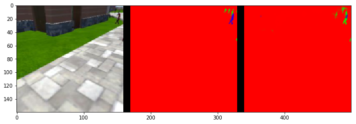

[](https://www.udacity.com/robotics)

# Deep Learning Project : Target Tracking Drone #

This is the 4th project of Udacity's Robotics Nano Degree program.
For this project, we want a drone to identify a moving target and follows it in a simulated environment.
We are interested in not only to identify the target from the scene, but also to locate where in the scene the target is so that the drone can tracks it. 
To do so, a Fully Convolutional Network (FCN) is designed and trained.

# Network Architecture #
The task of identifying and locating a target class from the given scene is called scene understanding, and FCN is well-suited for such task.
In contrast to classic Convolutional Neural Network (CNN), FCN can learn to approximate the pixel locations for the target class.
It does this by replacing CNN's fully connected layer with 1x1 convolutional network followed by upsampling transposed convolutional layers. For better understanding of FCN, let's briefly talk about what CNN is. 


The general idea of CNN is to add the convolutional layers to squeeze the spatial dimensions and at the same time to increase the depth to find a general representation of the image. With the additional parameters added each layer, the goal is to learn the weights of these parameters to effectively classifies the objects. The classification occurs at the last flattend layer called fully connected layer. Because of this flattened layer, CNN works effectively for a question like 'is this a photo of hotdog?', however, due to its loss in spatial information during flattening, it doesn't help to answer a question for 'where in this photo is a hotdog?'. 


To answer the 'where is the hotdog?' question, we need to preserve the pixel location information. It turns out that we can acheive this by replacing the flattend fully connected layer with 1x1 convolutional layer to keep the output as a tensor. 
At last, we use a series of upsampling transposed convolutional layers to retrieve the original dimension of the image. 


Structurally, FCN comprises of encoder part and decoder part, with 1x1 convolutional layer in between them. The encoder part is to extract the features of images and the decoder up-scales the output of the encoder part to achieve the same dimension with the original input image. 

## FCN Model ## 
The overall diagram of the FCN model is shown below. It consists of 3 encoder layers, 1 1x1 convolutional layer, and 3 decoder layers. The decoder layers are added with skip connections to enhance the segmentation. I chose 3 layers based on the final scores of 4 trials: 1 layer only, 2 layers, 3 layers, and 4 layers. The trials were done with all other hyperparameters unchanged.  


Below is the code block of the model.

```python
def fcn_model(inputs, num_classes):
    
    print("original image shape is : ",inputs.shape)
    # Add Encoder Blocks. 
    encoder1 = encoder_block(inputs,filters = 32, strides = 2)
    print("encoder1 layer shape is : ",encoder1.shape)
    encoder2 = encoder_block(encoder1,filters = 64, strides = 2)
    print("encoder2 layer shape is : ",encoder2.shape)
    encoder3 = encoder_block(encoder2,filters = 128, strides = 2)
    print("encoder3 layer shape is : ",encoder3.shape)
       
    # Add 1x1 Convolution layer using conv2d_batchnorm().
    conv1x1 = conv2d_batchnorm(encoder3,filters=256,kernel_size=1,strides=1)
    print("1x1 conv layer shape is : ",conv1x1.shape)
    
    # Add the same number of Decoder Blocks as the number of Encoder Blocks
    decoder1 = decoder_block(conv1x1,encoder2,filters=128)
    print("decoder1 layer shape is : ",decoder1.shape)
    decoder2 = decoder_block(decoder1,encoder1,filters=64)
    print("decoder2 layer shape is : ",decoder2.shape)
    decoder3 = decoder_block(decoder2,inputs,filters=32)
    print("decoder3 layer shape is : ",decoder3.shape)
    
    # The function returns the output layer of your model. 
    outputs = layers.Conv2D(num_classes, 1, activation='softmax', padding='same')(decoder3)
    print("output   layer shape is : ",outputs.shape)
    
    return outputs
```
## Hyperparameters ##
Hyperparameters I tuned consists of the following: 
* **learning rate**: number that governs the increment rate during the gradient descent search. 
* **batch size**: number of training samples/images that get propagated through the network in a single pass.
* **number of epochs**: number of times the entire training dataset gets propagated through the network.
* **steps per epoch**: number of batches of training images that go through the network in 1 epoch. One recommended value to try would be based on the total number of images in training dataset divided by the batch_size.
* **validation steps**: number of batches of validation images that go through the network in 1 epoch. This is similar to steps_per_epoch, except validation_steps is for the validation dataset. 
* **workers**: maximum number of processes to spin up. This can affect your training speed and is dependent on your hardware. 

### Learning Rate ###
In theory, high learning rate can converge faster at the beginning, but it could also miss the local minimum by 'jumping' too far. On the other hand, too small value can take a lot of time to compute. For this reason, I have tested the learnign rate values of 0.1, 0.01, 0.005, and 0.001. I chose 0.01 as the learning rate as this results good score without casuing too much computation.   

### Batch Size ###
Ideally, it is desired to train all the parameters at once by incorporating all the data. However, this requires large memory space and therefore, it may not be feasible. As a remedy, mini-batching technique is used. The input data is divided into the batches whose sizes can be defined by the users. In general, larger the batch size is, better the results is and longer it takes to compute. In my setup, I was able to increase the batch size up to 150. 

### Number of Epochs ###
An epoch is a single forward and bacward pass of the entire dataset. Increasing the number of epochs can improve the result without acquiring additional data. However, the improvement plateaus out, so it is wise not to increase the number too much. From trial and error, I found that 50 is large enough to improve the results.

### Steps per Epoch & Validation Steps ###
The recommended values are used for both hyperparameters.

### Workers ###
To speed up, I have set the maximum number of processes to 8. 


# Simulation Results #
Now that the model is trained, we can make predictions on the validation dataset. The predictions are compared to the ground truth mask images to evaluate the prediction scores
There are three different predictions available from the helper code provided:
- **patrol with targ**: Test how well the network can detect the hero from a distance.
- **patrol non targ**: Test how often the network makes a mistake and identifies the wrong person as the target.
- **following images**: Test how well the network can identify the target while following them.

## Patrol with target ##





```python
# This score measures how well the neural network can detect the target from far away
true_pos3, false_pos3, false_neg3, iou3 = scoring_utils.score_run_iou(val_with_targ, pred_with_targ)
```

    number of validation samples intersection over the union evaulated on 322
    average intersection over union for background is 0.9957292364884683
    average intersection over union for other people is 0.44501823174634714
    average intersection over union for the hero is 0.2175819935815745
    number true positives: 132, number false positives: 2, number false negatives: 169


### Patrol without target ###


```python
# Scores for images while the quad is on patrol and the target is not visable
true_pos2, false_pos2, false_neg2, iou2 = scoring_utils.score_run_iou(val_no_targ, pred_no_targ)
```

    number of validation samples intersection over the union evaulated on 270
    average intersection over union for background is 0.9856937563867086
    average intersection over union for other people is 0.7418870638156585
    average intersection over union for the hero is 0.0
    number true positives: 0, number false positives: 49, number false negatives: 0


### Following the target ##


```python
# Scores for while the quad is following behind the target. 
true_pos1, false_pos1, false_neg1, iou1 = scoring_utils.score_run_iou(val_following, pred_following)
```

    number of validation samples intersection over the union evaulated on 542
    average intersection over union for background is 0.9953295694111575
    average intersection over union for other people is 0.35807991198690364
    average intersection over union for the hero is 0.8959929639940952
    number true positives: 539, number false positives: 0, number false negatives: 0

### Final Scores ###

```python
# Sum all the true positives, etc from the three datasets to get a weight for the score
true_pos = true_pos1 + true_pos2 + true_pos3
false_pos = false_pos1 + false_pos2 + false_pos3
false_neg = false_neg1 + false_neg2 + false_neg3

weight = true_pos/(true_pos+false_neg+false_pos)
print(weight)
```

    0.7530864197530864


```python
# The IoU for the dataset that never includes the hero is excluded from grading
final_IoU = (iou1 + iou3)/2
print(final_IoU)
```

    0.556787478788


```python
# And the final grade score is 
final_score = final_IoU * weight
print(final_score)
```

    0.419309088964
    
    
# Conclusions and Future Work #
In this project, Fully Convolutional Network has been designed to identify and locate the target hero from the scene. With the provided data, I was able to achieve a final score of 41.9%. To improve the score, we need more data of showing the target in different angles and sitances to train our model better. 

```
$ python follower.py my_amazing_model.h5
```

**Note:** If you'd like to see an overlay of the detected region on each camera frame from the drone, simply pass the `--pred_viz` parameter to `follower.py`
