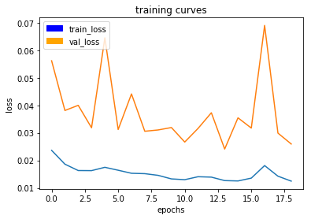
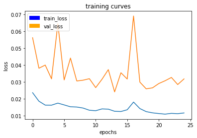
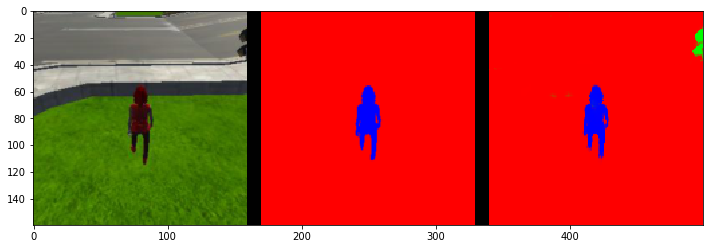
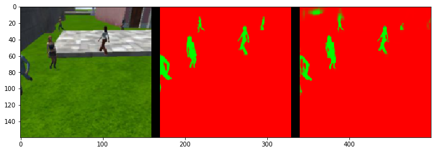
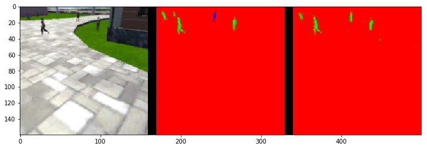
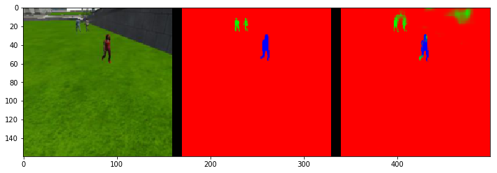

# Follow-Me Project
Congratulations on reaching the final project of the Robotics Nanodegree! 

Previously, you worked on the Semantic Segmentation lab where you built a deep learning network that locates a particular human target within an image. For this project, you will utilize what you implemented and learned from that lab and extend it to train a deep learning model that will allow a simulated quadcopter to follow around the person that it detects! 

Most of the code below is similar to the lab with some minor modifications. You can start with your existing solution, and modify and improve upon it to train the best possible model for this task.

You can click on any of the following to quickly jump to that part of this notebook:
1. [Data Collection](#data)
2. [FCN Layers](#fcn)
3. [Build the Model](#build)
4. [Training](#training)
5. [Prediction](#prediction)
6. [Evaluation](#evaluation)

## Data Collection<a id='data'></a>
We have provided you with a starting dataset for this project. Download instructions can be found in the README for this project's repo.
Alternatively, you can collect additional data of your own to improve your model. Check out the "Collecting Data" section in the Project Lesson in the Classroom for more details!


```python
import os
import glob
import sys
import tensorflow as tf

from scipy import misc
import numpy as np

from tensorflow.contrib.keras.python import keras
from tensorflow.contrib.keras.python.keras import layers, models

from tensorflow import image

from utils import scoring_utils
from utils.separable_conv2d import SeparableConv2DKeras, BilinearUpSampling2D
from utils import data_iterator
from utils import plotting_tools 
from utils import model_tools
```

## FCN Layers <a id='fcn'></a>
In the Classroom, we discussed the different layers that constitute a fully convolutional network (FCN). The following code will introduce you to the functions that you need to build your semantic segmentation model.

### Separable Convolutions
The Encoder for your FCN will essentially require separable convolution layers, due to their advantages as explained in the classroom. The 1x1 convolution layer in the FCN, however, is a regular convolution. Implementations for both are provided below for your use. Each includes batch normalization with the ReLU activation function applied to the layers. 


```python
def separable_conv2d_batchnorm(input_layer, filters, strides=1):
    output_layer = SeparableConv2DKeras(filters=filters,kernel_size=3, strides=strides,
                             padding='same', activation='relu')(input_layer)
    
    output_layer = layers.BatchNormalization()(output_layer) 
    return output_layer

def conv2d_batchnorm(input_layer, filters, kernel_size=3, strides=1):
    output_layer = layers.Conv2D(filters=filters, kernel_size=kernel_size, strides=strides, 
                      padding='same', activation='relu')(input_layer)
    
    output_layer = layers.BatchNormalization()(output_layer) 
    return output_layer
```

### Bilinear Upsampling
The following helper function implements the bilinear upsampling layer. Upsampling by a factor of 2 is generally recommended, but you can try out different factors as well. Upsampling is used in the decoder block of the FCN.


```python
def bilinear_upsample(input_layer):
    output_layer = BilinearUpSampling2D((2,2))(input_layer)
    return output_layer
```

## Build the Model <a id='build'></a>
In the following cells, you will build an FCN to train a model to detect and locate the hero target within an image. The steps are:
- Create an `encoder_block`
- Create a `decoder_block`
- Build the FCN consisting of encoder block(s), a 1x1 convolution, and decoder block(s).  This step requires experimentation with different numbers of layers and filter sizes to build your model.

### Encoder Block
Create an encoder block that includes a separable convolution layer using the `separable_conv2d_batchnorm()` function. The `filters` parameter defines the size or depth of the output layer. For example, 32 or 64. 


```python
def encoder_block(input_layer, filters, strides):
    
    output_layer = separable_conv2d_batchnorm(input_layer, filters, strides)
    
    return output_layer
```

### Decoder Block
The decoder block is comprised of three parts:
- A bilinear upsampling layer using the upsample_bilinear() function. The current recommended factor for upsampling is set to 2.
- A layer concatenation step. This step is similar to skip connections. You will concatenate the upsampled small_ip_layer and the large_ip_layer.
- Some (one or two) additional separable convolution layers to extract some more spatial information from prior layers.


```python
def decoder_block(small_ip_layer, large_ip_layer, filters):
    
    # Upsample the small input layer using the bilinear_upsample() function.
    upsampled_layer = bilinear_upsample(small_ip_layer)
    # Concatenate the upsampled and large input layers using layers.concatenate
    concat_layer = layers.concatenate([upsampled_layer, large_ip_layer])
    # Add some number of separable convolution layers
    output_layer = separable_conv2d_batchnorm(concat_layer,filters, strides=1)
       
    return output_layer
```

### Model

Now that you have the encoder and decoder blocks ready, go ahead and build your FCN architecture! 

There are three steps:
- Add encoder blocks to build the encoder layers. This is similar to how you added regular convolutional layers in your CNN lab.
- Add a 1x1 Convolution layer using the conv2d_batchnorm() function. Remember that 1x1 Convolutions require a kernel and stride of 1.
- Add decoder blocks for the decoder layers.


```python
def fcn_model(inputs, num_classes):
    
    print("original image shape is : ",inputs.shape)
    # TODO Add Encoder Blocks. 
    # Remember that with each encoder layer, the depth of your model (the number of filters) increases.
    encoder1 = encoder_block(inputs,filters = 32, strides = 2)
    print("encoder1 layer shape is : ",encoder1.shape)
    encoder2 = encoder_block(encoder1,filters = 64, strides = 2)
    print("encoder2 layer shape is : ",encoder2.shape)
    encoder3 = encoder_block(encoder2,filters = 128, strides = 2)
    print("encoder3 layer shape is : ",encoder3.shape)
    #encoder4 = encoder_block(encoder3,filters = 256, strides = 1)
    #print("encoder4 layer shape is : ",encoder4.shape)
    
    # TODO Add 1x1 Convolution layer using conv2d_batchnorm().
    conv1x1 = conv2d_batchnorm(encoder3,filters=256,kernel_size=1,strides=1)
    print("1x1 conv layer shape is : ",conv1x1.shape)
    
    # TODO: Add the same number of Decoder Blocks as the number of Encoder Blocks
    decoder1 = decoder_block(conv1x1,encoder2,filters=128)
    print("decoder1 layer shape is : ",decoder1.shape)
    decoder2 = decoder_block(decoder1,encoder1,filters=64)
    print("decoder2 layer shape is : ",decoder2.shape)
    decoder3 = decoder_block(decoder2,inputs,filters=32)
    print("decoder3 layer shape is : ",decoder3.shape)
    #decoder4 = decoder_block(decoder3,inputs,32)
    #print("decoder4 layer shape is : ",decoder4.shape)
    
    # The function returns the output layer of your model. "x" is the final layer obtained from the last decoder_block()
    outputs = layers.Conv2D(num_classes, 1, activation='softmax', padding='same')(decoder3)
    print("output   layer shape is : ",outputs.shape)
    return outputs
```

## Training <a id='training'></a>
The following cells will use the FCN you created and define an ouput layer based on the size of the processed image and the number of classes recognized. You will define the hyperparameters to compile and train your model.

Please Note: For this project, the helper code in `data_iterator.py` will resize the copter images to 160x160x3 to speed up training.


```python
"""
DON'T MODIFY ANYTHING IN THIS CELL THAT IS BELOW THIS LINE
"""

image_hw = 160
image_shape = (image_hw, image_hw, 3)
inputs = layers.Input(image_shape)
num_classes = 3

# Call fcn_model()
output_layer = fcn_model(inputs, num_classes)
```

    original image shape is :  (?, 160, 160, 3)
    encoder1 layer shape is :  (?, 80, 80, 32)
    encoder2 layer shape is :  (?, 40, 40, 64)
    encoder3 layer shape is :  (?, 20, 20, 128)
    1x1 conv layer shape is :  (?, 20, 20, 256)
    decoder1 layer shape is :  (?, 40, 40, 128)
    decoder2 layer shape is :  (?, 80, 80, 64)
    decoder3 layer shape is :  (?, 160, 160, 32)
    output   layer shape is :  (?, 160, 160, 3)


### Hyperparameters
Define and tune your hyperparameters.
- **batch_size**: number of training samples/images that get propagated through the network in a single pass.
- **num_epochs**: number of times the entire training dataset gets propagated through the network.
- **steps_per_epoch**: number of batches of training images that go through the network in 1 epoch. We have provided you with a default value. One recommended value to try would be based on the total number of images in training dataset divided by the batch_size.
- **validation_steps**: number of batches of validation images that go through the network in 1 epoch. This is similar to steps_per_epoch, except validation_steps is for the validation dataset. We have provided you with a default value for this as well.
- **workers**: maximum number of processes to spin up. This can affect your training speed and is dependent on your hardware. We have provided a recommended value to work with. 


```python
learning_rate = 0.01
batch_size = 150
num_epochs = 50
steps_per_epoch = 50
validation_steps = 20
workers = 8
```


```python
"""
DON'T MODIFY ANYTHING IN THIS CELL THAT IS BELOW THIS LINE
"""

from workspace_utils import active_session
# Keeping Your Session Active
with active_session():
    # Define the Keras model and compile it for training
    model = models.Model(inputs=inputs, outputs=output_layer)

    model.compile(optimizer=keras.optimizers.Adam(learning_rate), loss='categorical_crossentropy')

    # Data iterators for loading the training and validation data
    train_iter = data_iterator.BatchIteratorSimple(batch_size=batch_size,
                                                   data_folder=os.path.join('..', 'data', 'train'),
                                                   image_shape=image_shape,
                                                   shift_aug=True)

    val_iter = data_iterator.BatchIteratorSimple(batch_size=batch_size,
                                                 data_folder=os.path.join('..', 'data', 'validation'),
                                                 image_shape=image_shape)

    logger_cb = plotting_tools.LoggerPlotter()
    callbacks = [logger_cb]

    model.fit_generator(train_iter,
                        steps_per_epoch = steps_per_epoch, # the number of batches per epoch,
                        epochs = num_epochs, # the number of epochs to train for,
                        validation_data = val_iter, # validation iterator
                        validation_steps = validation_steps, # the number of batches to validate on
                        callbacks=callbacks,
                        workers = workers)
```

    Epoch 1/50
    49/50 [============================>.] - ETA: 1s - loss: 0.0236


    50/50 [==============================] - 113s - loss: 0.0236 - val_loss: 0.0562
    Epoch 2/50
    49/50 [============================>.] - ETA: 1s - loss: 0.0186


    50/50 [==============================] - 109s - loss: 0.0186 - val_loss: 0.0381
    Epoch 3/50
    49/50 [============================>.] - ETA: 1s - loss: 0.0161


    50/50 [==============================] - 109s - loss: 0.0163 - val_loss: 0.0400
    Epoch 4/50
    49/50 [============================>.] - ETA: 1s - loss: 0.0163


    50/50 [==============================] - 109s - loss: 0.0163 - val_loss: 0.0318
    Epoch 5/50
    49/50 [============================>.] - ETA: 1s - loss: 0.0177


    50/50 [==============================] - 109s - loss: 0.0177 - val_loss: 0.0645
    Epoch 6/50
    49/50 [============================>.] - ETA: 1s - loss: 0.0164


    50/50 [==============================] - 108s - loss: 0.0164 - val_loss: 0.0312
    Epoch 7/50
    49/50 [============================>.] - ETA: 1s - loss: 0.0153


    50/50 [==============================] - 109s - loss: 0.0153 - val_loss: 0.0441
    Epoch 8/50
    49/50 [============================>.] - ETA: 1s - loss: 0.0152


    50/50 [==============================] - 108s - loss: 0.0152 - val_loss: 0.0306
    Epoch 9/50
    49/50 [============================>.] - ETA: 1s - loss: 0.0146


    50/50 [==============================] - 109s - loss: 0.0146 - val_loss: 0.0310
    Epoch 10/50
    49/50 [============================>.] - ETA: 1s - loss: 0.0133


    50/50 [==============================] - 110s - loss: 0.0133 - val_loss: 0.0319
    Epoch 11/50
    49/50 [============================>.] - ETA: 1s - loss: 0.0129


    50/50 [==============================] - 110s - loss: 0.0130 - val_loss: 0.0267
    Epoch 12/50
    49/50 [============================>.] - ETA: 1s - loss: 0.0141


    50/50 [==============================] - 109s - loss: 0.0141 - val_loss: 0.0316
    Epoch 13/50
    49/50 [============================>.] - ETA: 1s - loss: 0.0138


    50/50 [==============================] - 108s - loss: 0.0139 - val_loss: 0.0373
    Epoch 14/50
    49/50 [============================>.] - ETA: 1s - loss: 0.0126


    50/50 [==============================] - 109s - loss: 0.0126 - val_loss: 0.0241
    Epoch 15/50
    49/50 [============================>.] - ETA: 1s - loss: 0.0124


    50/50 [==============================] - 109s - loss: 0.0125 - val_loss: 0.0355
    Epoch 16/50
    49/50 [============================>.] - ETA: 1s - loss: 0.0136


    50/50 [==============================] - 109s - loss: 0.0136 - val_loss: 0.0317
    Epoch 17/50
    49/50 [============================>.] - ETA: 1s - loss: 0.0181


    50/50 [==============================] - 108s - loss: 0.0181 - val_loss: 0.0690
    Epoch 18/50
    49/50 [============================>.] - ETA: 1s - loss: 0.0143


    50/50 [==============================] - 109s - loss: 0.0142 - val_loss: 0.0299
    Epoch 19/50
    49/50 [============================>.] - ETA: 1s - loss: 0.0125





    50/50 [==============================] - 109s - loss: 0.0125 - val_loss: 0.0259
    Epoch 20/50
    49/50 [============================>.] - ETA: 1s - loss: 0.0117


    50/50 [==============================] - 109s - loss: 0.0117 - val_loss: 0.0265
    Epoch 21/50
    49/50 [============================>.] - ETA: 1s - loss: 0.0113


    50/50 [==============================] - 108s - loss: 0.0113 - val_loss: 0.0291
    Epoch 22/50
    49/50 [============================>.] - ETA: 1s - loss: 0.0109


    50/50 [==============================] - 108s - loss: 0.0110 - val_loss: 0.0307
    Epoch 23/50
    49/50 [============================>.] - ETA: 1s - loss: 0.0114


    50/50 [==============================] - 109s - loss: 0.0114 - val_loss: 0.0327
    Epoch 24/50
    49/50 [============================>.] - ETA: 1s - loss: 0.0112


    50/50 [==============================] - 110s - loss: 0.0112 - val_loss: 0.0285
    Epoch 25/50
    49/50 [============================>.] - ETA: 1s - loss: 0.0117





    50/50 [==============================] - 108s - loss: 0.0117 - val_loss: 0.0318
    Epoch 26/50
    49/50 [============================>.] - ETA: 1s - loss: 0.0139


    50/50 [==============================] - 108s - loss: 0.0139 - val_loss: 0.0313
    Epoch 27/50
    49/50 [============================>.] - ETA: 1s - loss: 0.0119


    50/50 [==============================] - 110s - loss: 0.0119 - val_loss: 0.0263
    Epoch 28/50
    49/50 [============================>.] - ETA: 1s - loss: 0.0110


    50/50 [==============================] - 109s - loss: 0.0110 - val_loss: 0.0262
    Epoch 29/50
    49/50 [============================>.] - ETA: 1s - loss: 0.0102


    50/50 [==============================] - 109s - loss: 0.0102 - val_loss: 0.0251
    Epoch 30/50
    49/50 [============================>.] - ETA: 1s - loss: 0.0102


    50/50 [==============================] - 109s - loss: 0.0102 - val_loss: 0.0284
    Epoch 31/50
    49/50 [============================>.] - ETA: 1s - loss: 0.0098


    50/50 [==============================] - 109s - loss: 0.0097 - val_loss: 0.0289
    Epoch 32/50
    49/50 [============================>.] - ETA: 1s - loss: 0.0097


    50/50 [==============================] - 109s - loss: 0.0097 - val_loss: 0.0293
    Epoch 33/50
    49/50 [============================>.] - ETA: 1s - loss: 0.0096


    50/50 [==============================] - 111s - loss: 0.0096 - val_loss: 0.0298
    Epoch 34/50
    49/50 [============================>.] - ETA: 1s - loss: 0.0096


    50/50 [==============================] - 108s - loss: 0.0095 - val_loss: 0.0317
    Epoch 35/50
    49/50 [============================>.] - ETA: 1s - loss: 0.0095


    50/50 [==============================] - 109s - loss: 0.0095 - val_loss: 0.0318
    Epoch 36/50
    49/50 [============================>.] - ETA: 1s - loss: 0.0094


    50/50 [==============================] - 109s - loss: 0.0094 - val_loss: 0.0300
    Epoch 37/50
    49/50 [============================>.] - ETA: 1s - loss: 0.0096


    50/50 [==============================] - 109s - loss: 0.0095 - val_loss: 0.0291
    Epoch 38/50
    49/50 [============================>.] - ETA: 1s - loss: 0.0095


    50/50 [==============================] - 110s - loss: 0.0095 - val_loss: 0.0292
    Epoch 39/50
    49/50 [============================>.] - ETA: 1s - loss: 0.0094


    50/50 [==============================] - 110s - loss: 0.0094 - val_loss: 0.0289
    Epoch 40/50
    49/50 [============================>.] - ETA: 1s - loss: 0.0093


    50/50 [==============================] - 109s - loss: 0.0093 - val_loss: 0.0306
    Epoch 41/50
    49/50 [============================>.] - ETA: 1s - loss: 0.0159


    50/50 [==============================] - 109s - loss: 0.0161 - val_loss: 0.1537
    Epoch 42/50
    49/50 [============================>.] - ETA: 1s - loss: 0.0213


    50/50 [==============================] - 109s - loss: 0.0212 - val_loss: 0.0520
    Epoch 43/50
    49/50 [============================>.] - ETA: 1s - loss: 0.0159


    50/50 [==============================] - 109s - loss: 0.0159 - val_loss: 0.0380
    Epoch 44/50
    49/50 [============================>.] - ETA: 1s - loss: 0.0145


    50/50 [==============================] - 108s - loss: 0.0145 - val_loss: 0.0388
    Epoch 45/50
    49/50 [============================>.] - ETA: 1s - loss: 0.0135


    50/50 [==============================] - 108s - loss: 0.0134 - val_loss: 0.0304
    Epoch 46/50
    49/50 [============================>.] - ETA: 1s - loss: 0.0124


    50/50 [==============================] - 110s - loss: 0.0123 - val_loss: 0.0274
    Epoch 47/50
    49/50 [============================>.] - ETA: 1s - loss: 0.0120


    50/50 [==============================] - 111s - loss: 0.0120 - val_loss: 0.0279
    Epoch 48/50
    49/50 [============================>.] - ETA: 1s - loss: 0.0109


    50/50 [==============================] - 110s - loss: 0.0109 - val_loss: 0.0295
    Epoch 49/50
    49/50 [============================>.] - ETA: 1s - loss: 0.0103


    50/50 [==============================] - 108s - loss: 0.0103 - val_loss: 0.0297
    Epoch 50/50
    49/50 [============================>.] - ETA: 1s - loss: 0.0102


    50/50 [==============================] - 109s - loss: 0.0102 - val_loss: 0.0266


```python
# Save your trained model weights
weight_file_name = 'model_weights_07'
model_tools.save_network(model, weight_file_name)
```

## Prediction <a id='prediction'></a>

Now that you have your model trained and saved, you can make predictions on your validation dataset. These predictions can be compared to the mask images, which are the ground truth labels, to evaluate how well your model is doing under different conditions.

There are three different predictions available from the helper code provided:
- **patrol_with_targ**: Test how well the network can detect the hero from a distance.
- **patrol_non_targ**: Test how often the network makes a mistake and identifies the wrong person as the target.
- **following_images**: Test how well the network can identify the target while following them.


```python
# If you need to load a model which you previously trained you can uncomment the codeline that calls the function below.

#weight_file_name = 'model_weights_02'
#restored_model = model_tools.load_network(weight_file_name)
```

The following cell will write predictions to files and return paths to the appropriate directories.
The `run_num` parameter is used to define or group all the data for a particular model run. You can change it for different runs. For example, 'run_1', 'run_2' etc.


```python
run_num = 'run_1'

val_with_targ, pred_with_targ = model_tools.write_predictions_grade_set(model,
                                        run_num,'patrol_with_targ', 'sample_evaluation_data') 

val_no_targ, pred_no_targ = model_tools.write_predictions_grade_set(model, 
                                        run_num,'patrol_non_targ', 'sample_evaluation_data') 

val_following, pred_following = model_tools.write_predictions_grade_set(model,
                                        run_num,'following_images', 'sample_evaluation_data')
```

Now lets look at your predictions, and compare them to the ground truth labels and original images.
Run each of the following cells to visualize some sample images from the predictions in the validation set.


```python
# images while following the target
im_files = plotting_tools.get_im_file_sample('sample_evaluation_data','following_images', run_num) 
for i in range(3):
    im_tuple = plotting_tools.load_images(im_files[i])
    plotting_tools.show_images(im_tuple)
    
```





```python
# images while at patrol without target
im_files = plotting_tools.get_im_file_sample('sample_evaluation_data','patrol_non_targ', run_num) 
for i in range(3):
    im_tuple = plotting_tools.load_images(im_files[i])
    plotting_tools.show_images(im_tuple)
 
```





```python
   
# images while at patrol with target
im_files = plotting_tools.get_im_file_sample('sample_evaluation_data','patrol_with_targ', run_num) 
for i in range(3):
    im_tuple = plotting_tools.load_images(im_files[i])
    plotting_tools.show_images(im_tuple)
```








## Evaluation <a id='evaluation'></a>
Evaluate your model! The following cells include several different scores to help you evaluate your model under the different conditions discussed during the Prediction step. 


```python
# Scores for while the quad is following behind the target. 
true_pos1, false_pos1, false_neg1, iou1 = scoring_utils.score_run_iou(val_following, pred_following)
```

    number of validation samples intersection over the union evaulated on 542
    average intersection over union for background is 0.9953295694111575
    average intersection over union for other people is 0.35807991198690364
    average intersection over union for the hero is 0.8959929639940952
    number true positives: 539, number false positives: 0, number false negatives: 0


```python
# Scores for images while the quad is on patrol and the target is not visable
true_pos2, false_pos2, false_neg2, iou2 = scoring_utils.score_run_iou(val_no_targ, pred_no_targ)
```

    number of validation samples intersection over the union evaulated on 270
    average intersection over union for background is 0.9856937563867086
    average intersection over union for other people is 0.7418870638156585
    average intersection over union for the hero is 0.0
    number true positives: 0, number false positives: 49, number false negatives: 0


```python
# This score measures how well the neural network can detect the target from far away
true_pos3, false_pos3, false_neg3, iou3 = scoring_utils.score_run_iou(val_with_targ, pred_with_targ)
```

    number of validation samples intersection over the union evaulated on 322
    average intersection over union for background is 0.9957292364884683
    average intersection over union for other people is 0.44501823174634714
    average intersection over union for the hero is 0.2175819935815745
    number true positives: 132, number false positives: 2, number false negatives: 169


```python
# Sum all the true positives, etc from the three datasets to get a weight for the score
true_pos = true_pos1 + true_pos2 + true_pos3
false_pos = false_pos1 + false_pos2 + false_pos3
false_neg = false_neg1 + false_neg2 + false_neg3

weight = true_pos/(true_pos+false_neg+false_pos)
print(weight)
```

    0.7530864197530864


```python
# The IoU for the dataset that never includes the hero is excluded from grading
final_IoU = (iou1 + iou3)/2
print(final_IoU)
```

    0.556787478788


```python
# And the final grade score is 
final_score = final_IoU * weight
print(final_score)
```

    0.419309088964


```python

```


```python

```
